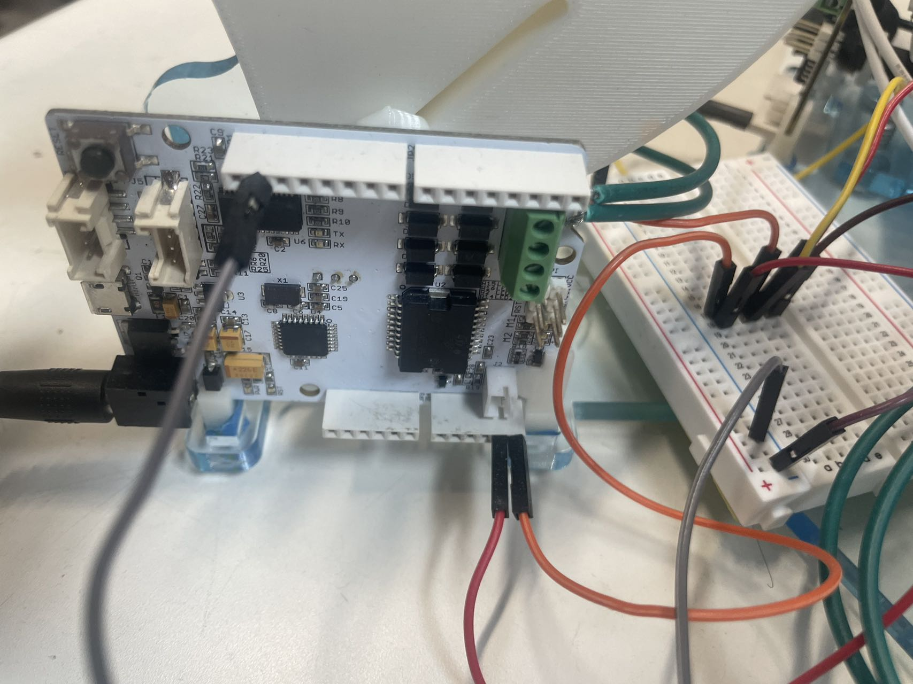

<!-- <div align="center"> -->
# **3D Hapkit**: A Low-Cost, Open-Source, 3-DOF Haptic Device Based on the Delta Parallel Mechanism
<div align="center">

</div>

The 3D Hapkit is a 3-Degrees-Of-Freedom haptic device that was created as a class project for Haptic Interface Design under Dr. Jeremy Brown in Fall 2022. The 3D Hapkit is based on the [Hapkit 3.0](https://hapkit.stanford.edu/) and was presented as WIP Paper and Demo at [2023 IEEE World Haptics](https://2023.worldhaptics.org/wp-content/uploads/2023/06/1070-doc.pdf). This device is an open-hardware haptic device designed to be low-cost(<$300) and easy to assemble, allowing users to input motions and feel programmed forces in three degrees of freedom. 

Moving forward, the 3D Hapkit will be deployed at the Johns Hopkins University Haptic Interface Design Course in Fall 2023!

<div align="center">


</div>

# **Build One**
## Hardware
<div align="center">

</div>  

## Dependency
- [GrabCAD Print Software](https://grabcad.com/print)
- FDM 3D Printer with [ABS filament](https://support.stratasys.com/en/Materials/FDM/ABSplus-P430)/[Soluble Support Material](https://support.stratasys.com/en/Materials/FDM/FDM-Support-Materials)([uPrint SE/uPrint SE Plus](https://support.stratasys.com/en/printers/fdm-legacy/uprint)/[Stratasys F123 Series](https://www.stratasys.com/en/3d-printers/printer-catalog/fdm-printers/f123-series-printers/))
- Laser Cutters([Universal Laser System – VLS6.60](https://www.pdi3d.com/Universal_Laser_VLS6_60_Laser_System_p/ul-vls660.htm?gclid=Cj0KCQjwj_ajBhCqARIsAA37s0wcB6R2M_kyPavgywdv_0DCIOlefbI1RGfbv-k4qdHt8GsdZ87696caAqnqEALw_wcB))
- Metric Tap and Die Set(1/4' - 20 & 10-24 & M4)
## Manufacture List
- Parts List: [Here is a parts list with purchase/manufacture information](https://htmlpreview.github.io/?https://github.com/HanZhang206/3D-Hapkit/blob/main/readmedoc/Manufacturing_List/ManufacturingList.html).
- STL files for 3D printing: [Click here to download a zip file of Hapkit STL Files](CAD_and_Manufacturing/3DPrint/3DPrint.zip). Note: Model units are in mm.
- DXF files for laser cutting: [Click here to download a zip file of Hapkit DXF Files](CAD_and_Manufacturing/LaserCut/LaserCut.zip).
- Modifiable SolidWorks files: [Click here to download a zip file of Hapkit SolidWorks Files](CAD_and_Manufacturing/CAD_File/3D-Hapkit.zip). Note: These are only for use with the SolidWorks CAD program.
- Assembly instructions and 3D printing tips: [Here are instructions for assembling your Hapkit into a functional haptic device](readmedoc/assembly.md).

<div align="center">

</div>

## Electronics 
<div align="center">

</div>

The electronics of the 3D Hapkit consist of three [Hapkit 3.0s](https://hapkit.stanford.edu/build.html). The Hapkit board can be purchased from [Seeed studio](https://www.seeedstudio.com/depot/hapkit-p-1622.html). It is also possible to manufacture your own PCB by combining an Arduino, motor driver and sensors. Here is a good starting point obtained from Seeed Studio([Files](readmedoc/HapkitSeeedPCB.zip)).

The three boards are communicating using the I2C protocol. We provid sample [Arduino code for follower](3DHapkit_Script/3DHapkit_Follower/3DHapkit_Follower.ino) and [leader](3DHapkit_Script/3DHapkit_Leader/3DHapkit_Learder.ino) to get you started porgramming haptic virtual environments with your 3D Hapkit. The code includes the calculation of forward kinematics and all readings values from sensors.

### To use 
- Connect the ground and I2C pins (A4/A5) of the three boards together.
  
- Choose one board as the leader and load the script(3DHapkit_Leader.ino).([Arduino IDE Download](https://www.arduino.cc/en/software)).
    - If want to use the serial monitor in the Arduino IDE, comment out **Line 79**(3DHapkit_Leader.ino) in the script:
    ```cpp
  #define PROCESSING 1 //connect to the processing for visualization
    ``` 
- Load the script(3DHapkit_Follower.ino) to two other boards. 
    - In **line 55** (**3DHapkit_Follower.ino**), assign address #8 to follower #1
    ```cpp
  Wire.begin(8);                // join i2c bus with address #8
    ```
    - In **line 58** (**3DHapkit_Follower.ino**), assign address #12 to follower #2
    ```cpp
  Wire.begin(12);                // join i2c bus with address #12
    ```


## Software 
We have created a sample scene for demo purposes. Users are able to control a ball (shown in green) by moving the handle. The ball is rendered in a virtual environment with a virtual surface. Our 3-DOF Hapkit is designed to simulate the virtual surface and render haptic interactions with the surface. Processing ([Download Here](https://processing.org/download)) was used to provide a better visualization.

### To use 
 - Download the [Processing](https://processing.org/download).
 - Open Processing and [deltaProcessing.pde](3DHapkit_Script/deltaProcessing/deltaProcessing.pde).
 - Connect the laptop to the leader board.
 - Check the USB port and change to correct one in **line 38**
     ```cpp
     myPort = new Serial(this, "com5", 115200); //change "com5" based on the local port connection 
      ```
 - Click 'Run'.

<div align="center">

</div>

# **Acknowledgement**
The development and implementation of the 3D Hapkit was supported by the [Haptics and Medical Robotics(HAMR) Laboratory](https://hamr.lcsr.jhu.edu/). Special thanks to Dr. Jeremy Brown for this guidance and invaluable advice.

The 3D Hapkit was made possible by the Hapkit: https://hapkit.stanford.edu/about.html

T. K. Morimoto, P. Blikstein and A. M. Okamura, "[D81] Hapkit: An open-hardware haptic device for online education," 2014 IEEE Haptics Symposium (HAPTICS), Houston, TX, USA, 2014, pp. 1-1, doi: 10.1109/HAPTICS.2014.6775560.

# **Contributors**
 - Han Zhang - MSE in Biomedical Engineering, Johns Hopkins University
 - Jan Bartels - MSE in Robotics, Johns Hopkins University
 - Yuting Zhang - MSE in Computer Science, Johns Hopkins University
