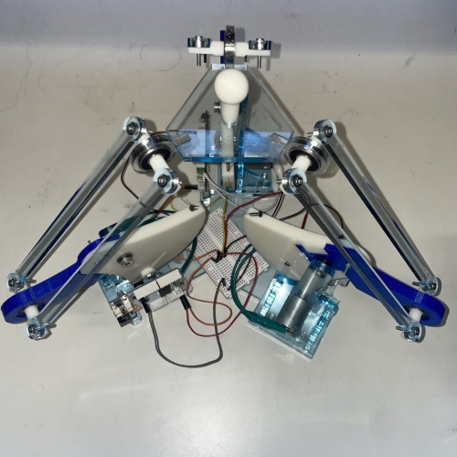
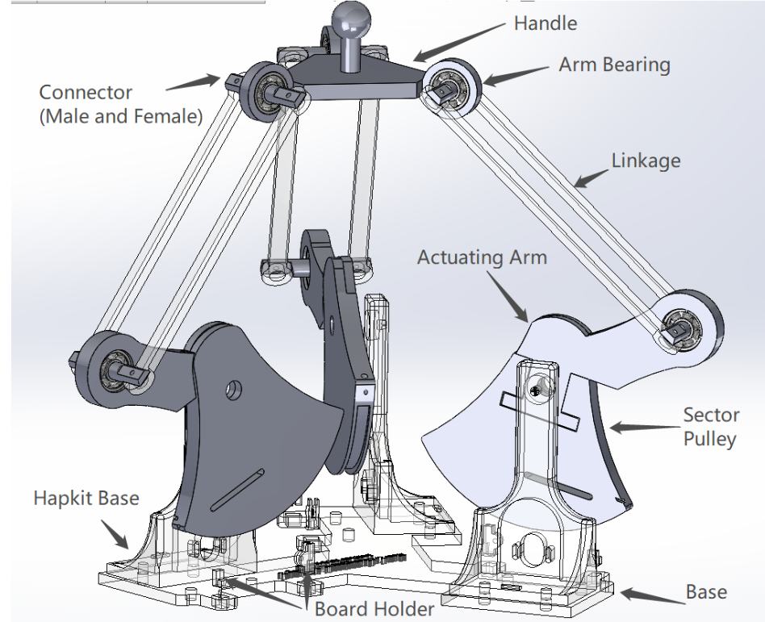
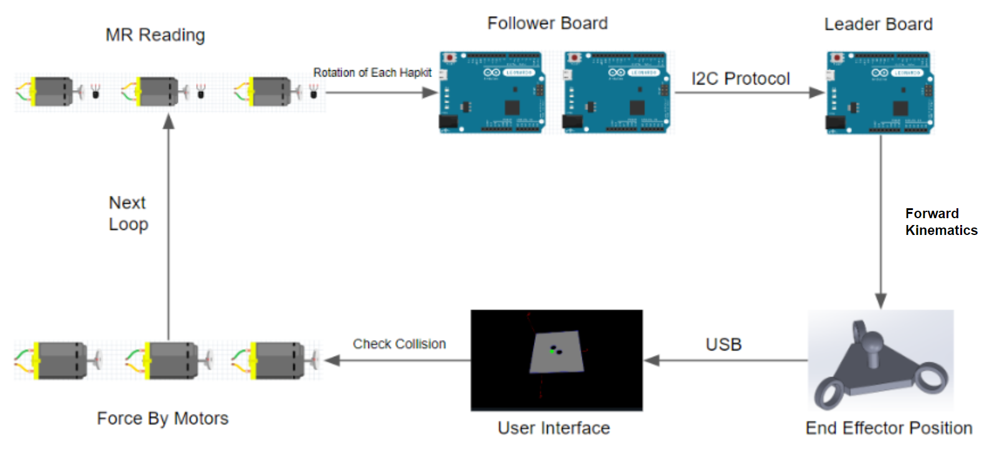
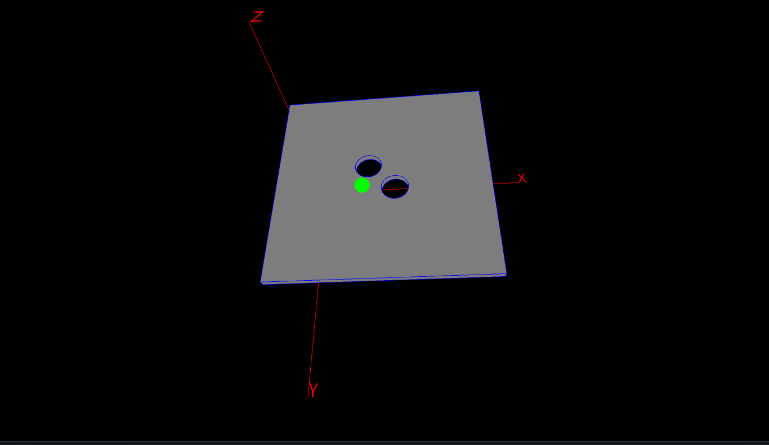

<div align="center">

# **3D Hapkit**: A Low-Cost, Open-Source, 3-DOF Haptic Device Based on the Delta Parallel Mechanism

</div>

3D Hapkit is a 3-DOF haptic device that was created as a customization project for [Hapkit 3.0](https://hapkit.stanford.edu/). The 3D Hapkit was presented as WIP Paper and Demo in [2023 IEEE World Haptics](https://2023.worldhaptics.org/wip-papers/). This device is an open-hardware haptic device designed to be low-cost(<$300) and easy to assemble, allowing users to input motions and feel programmed forces in three degrees of freedom. 

Moving forward, this 3D Hapkit will be deployed in the Johns Hopkins University Haptic Interface Design Course in Fall 2023!

<div align="center">


</div>

# **Build One**
## Hardware
<div align="center">

</div>  

## Dependency
- [GrabCAD Print Software](https://grabcad.com/print)
- FDM 3D Printer with [ABS filament](https://support.stratasys.com/en/Materials/FDM/ABSplus-P430)/[Soluble Support Material](https://support.stratasys.com/en/Materials/FDM/FDM-Support-Materials)([uPrint SE/uPrint SE Plus](https://support.stratasys.com/en/printers/fdm-legacy/uprint)/[Stratasys F123 Series](https://www.stratasys.com/en/3d-printers/printer-catalog/fdm-printers/f123-series-printers/))
- Laser Cutters([Universal Laser System – VLS6.60]())
- Metric Tap and Die Set(1/4' - 20 & M4)
## Manufacture List
- Parts List: [Here is a parts list with purchase information]().
- STL files for 3D printing: [Click here to download a zip file of Hapkit STL Files](). Note: Model units are in mm.
- DXF files for Laser cut: [Click here to download a zip file of Hapkit DXF Files9
- Modifiable SolidWorks files: [Click here to download a zip file of Hapkit SolidWorks Files](). Note: These are only for use with the SolidWorks CAD program.
- 3D printing tips: [Here are 3D printing tips for creating your 3D-printed Hapkit parts]().
- Assembly instructions: [Here are instructions for assembling your Hapkit into a functional haptic device]().

<div align="center">

</div>

## Electronics 
<div align="center">

</div>

The electronics of 3D Hapkit were consisted of three custom PCB([Link to Hapkit 3.0](https://hapkit.stanford.edu/build.html)), the size of an Arduino Uno and includes a microcontroller, motor driver/amplifier. The Hapkit board could be purchased from [Seeed studio](https://www.seeedstudio.com/depot/hapkit-p-1622.html). Also, you can manufacture your own PCB by combining the Arduino, motor driver and sensors. Here is a good starting point obtained from Seeed Studio([Files]()).

Those boards were communicated by using I2C protocol. We provided sample [Arduino code]() for follower and leader to get you started porgramming haptic virtual environments with you 3D Hapkit. The code includes the calculation of inverse kinematics and all readings values from sensors. 
### To use 
- Connect all I2C Ports(A4/A5).
- Connect all Ground Pin for three boards together.
- Choose one board as the leader and load the script(3DHapkit_Leader.ino).([Arduino IDE Download](https://www.arduino.cc/en/software)).
    - If want to use Serial monitor in Arduino IDE, commented out the **Line 79**(3DHapkit_Leader.ino) in script.
    ```cpp
  #define PROCESSING 1 //connect to the processing for visualization
    ``` 
- Load the script(3DHapkit_Follower.ino) to two other boards. 
    - In **line 55** (**3DHapkit_Follower.ino**), assign the address #8 for follower #1
    ```cpp
  Wire.begin(8);                // join i2c bus with address #8
    ```
    - In **line 58** (**3DHapkit_Follower.ino**), assign the address #12 for follower #2
    ```cpp
  Wire.begin(12);                // join i2c bus with address #12
    ```


## Software 
We create a sample scene for demo purpose. Users are able to control a ball(shown in green) by the handle to pass through the holes. Our 3-DOF Hapkit is designed to simulate that virtual wall and present haptic interaction with the wall. The Processing ([Download Here](https://processing.org/download)) was used to provide a better visualization.
### To use 
 - Download the [Processing](https://processing.org/download).
 - Open the Processing and [deltaProcessing.pde]().
 - Connect the laptop to the leader board.
 - Check the USB port and change to correct one in **line 38**
     ```cpp
     myPort = new Serial(this, "com5", 115200); //change "com5" based on the local port connection 
      ```
 - Click 'Run'.

<div align="center">

</div>

# **Acknowledgement**
The development and implementation of the 3D Hapkit is supported by [Haptics and Medical Robotics(HAMR) Laboratory](https://hamr.lcsr.jhu.edu/). Special thanks to Dr. Jeremy Brown for this guidance and invaluable advice.