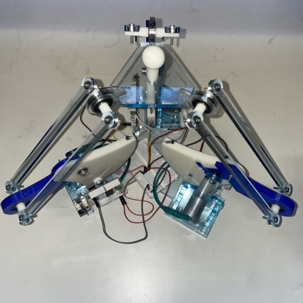
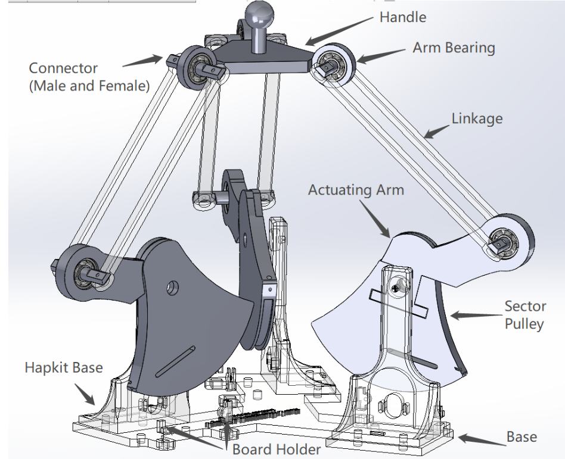
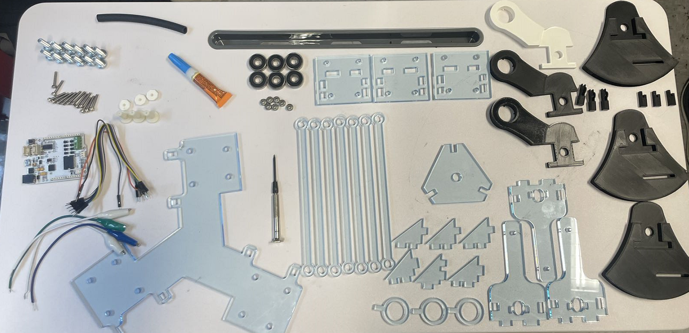
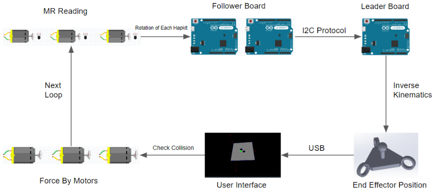
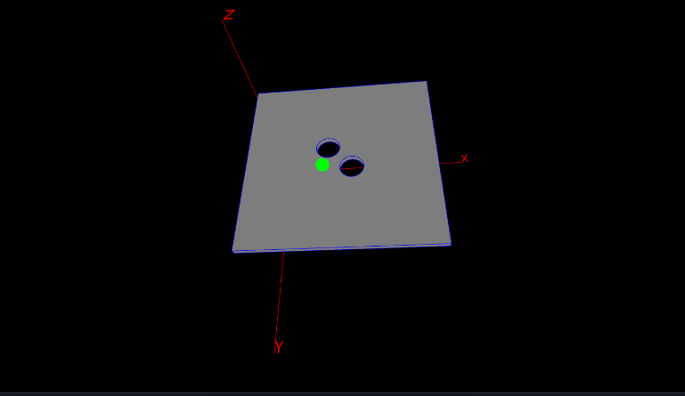

# 3D Hapkit: A Low-Cost, Open-Source, 3-DOF Haptic Device Based on the Delta Parallel Mechanism

3D Hapkit is a 3-DOF haptic device that was created as a customization project for [Hapkit 3.0](https://hapkit.stanford.edu/). The 3D Hapkit was presented as WIP Paper and Demo in [2023 IEEE World Haptics Conference](https://2023.worldhaptics.org/wip-papers/). This device is an open-hardware haptic device designed to be low-cost(<$300) and easy to assemble, allowing users to input motions and feel programmed forces in three degrees of freedom. Moving forward, this 3D Hapkit will be deployed in the Johns Hopkins University Haptic Interface Design Course in Fall 2023.

## Build One 
### Hardware

Parts List: Here is a parts list with purchase information

STL files for 3D printing: Click here to download a zip file of Hapkit STL Files. Note: Model units are in mm.

Modifiable SolidWorks files: Click here to download a zip file of Hapkit SolidWorks Files. Note: These are only for use with the SolidWorks CAD program.

3D printing tips: Here are 3D printing tips for creating your 3D-printed Hapkit parts.

Assembly instructions: Here are instructions for assembling your Hapkit into a functional haptic device

### Electronics 

### Software 

