# Assembly Instructions
 -  Obtain the all Hapkit components by purchasing, 3d printing and laser cutting
    
 - Gather the 10-24, 1/4in - 20 , and M4 tap and tap handle
 - Tap the thread for those parts

    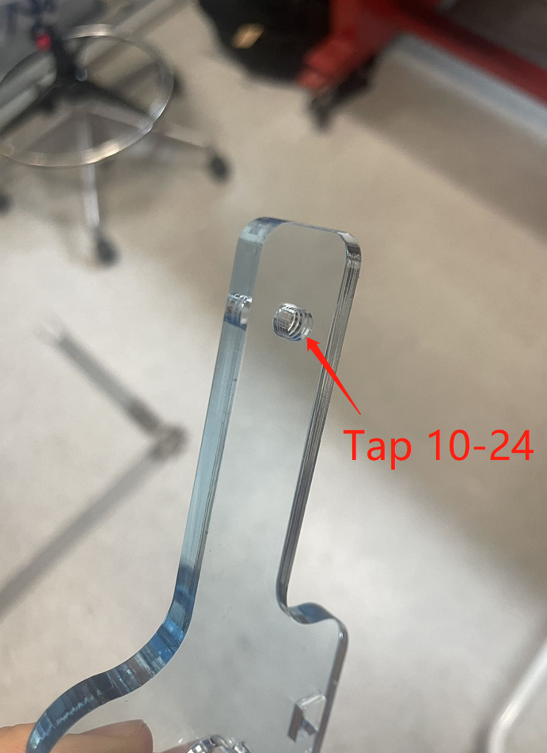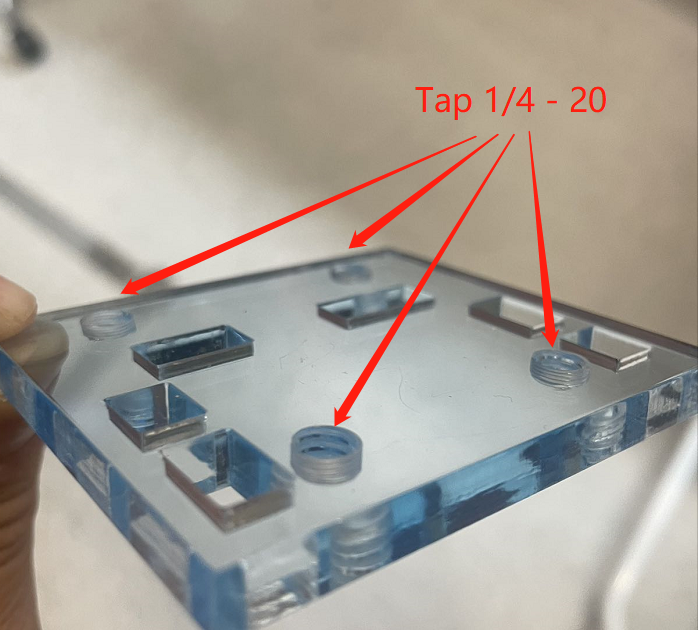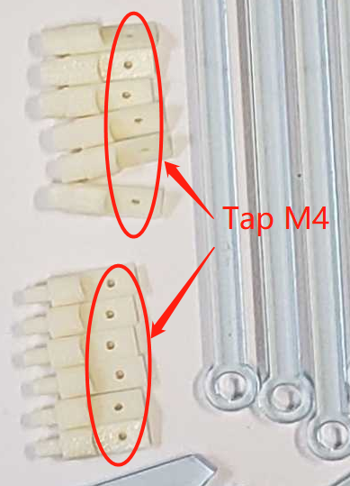
 - Install the base and stands with screws

    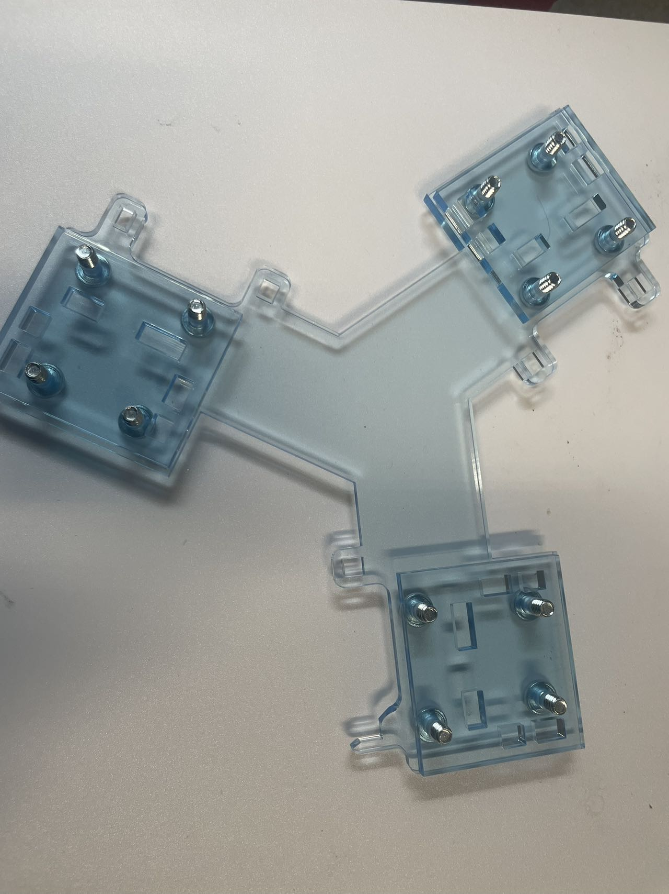
 - Assemble the parts by using super glue 

    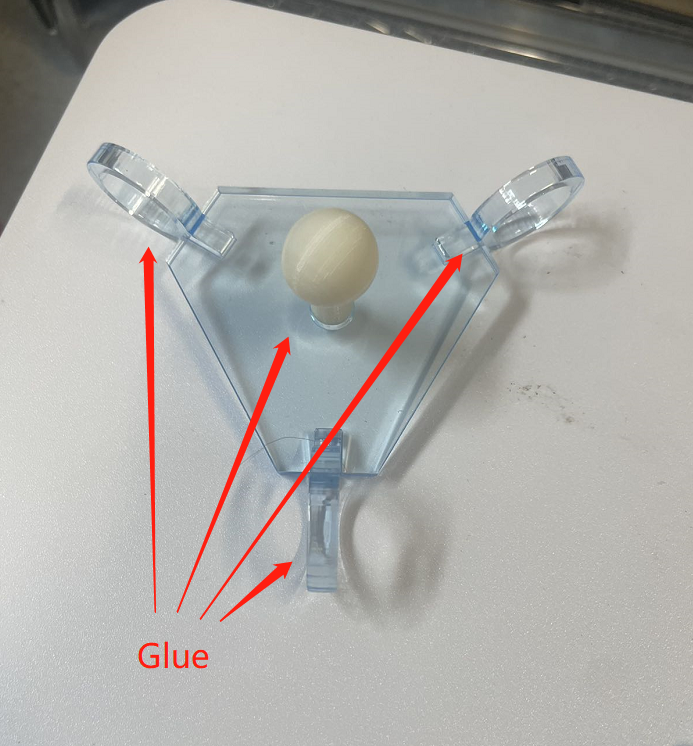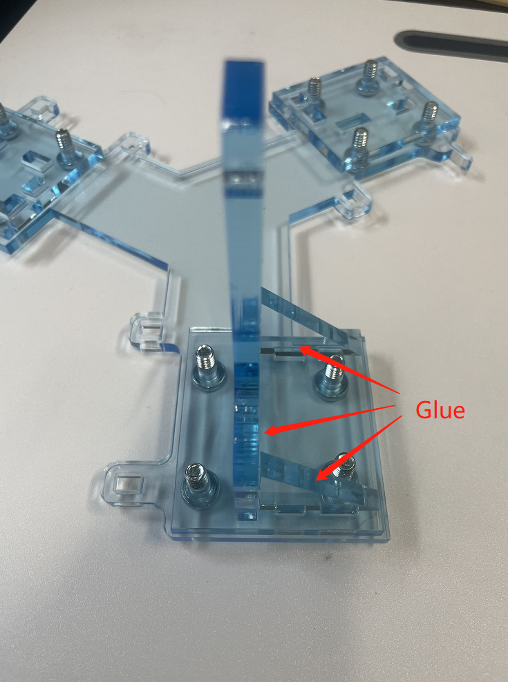
 - Assemble the device 
    - The detail of Hapkit assembly instructions can be found [here](https://hapkit.stanford.edu/files/HapkitAssemblyInstructions_v11_11_15.pdf)
    
    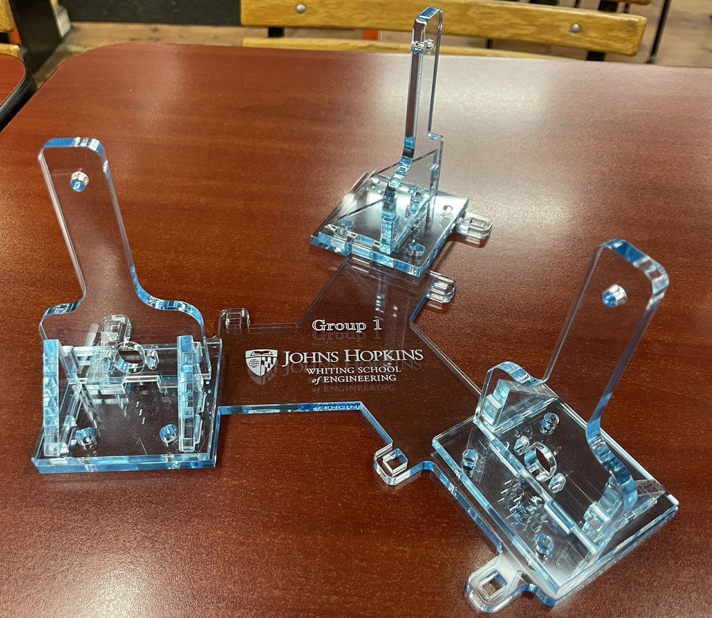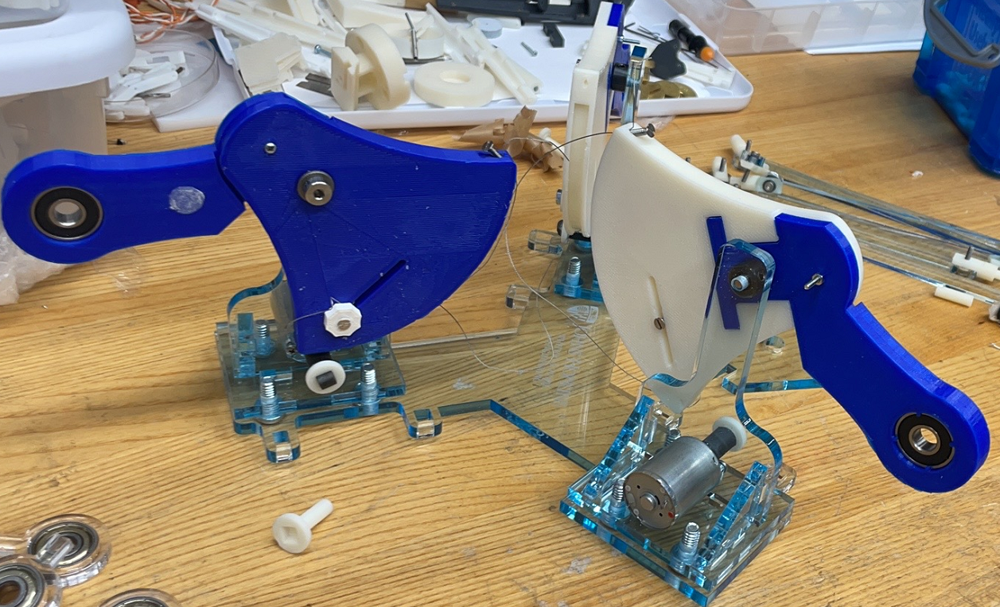
    
    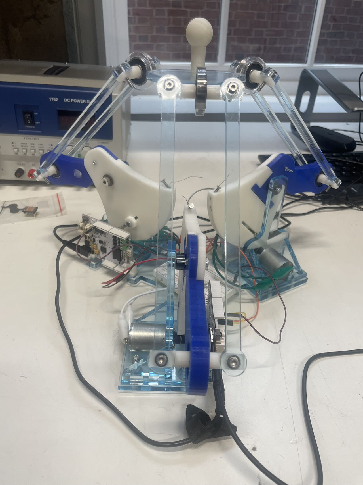
# 3D Printing Tip
- Import the cad files into the [GrabCAD Print software](https://grabcad.com/print).
- Position parts to the desired orientation to optimize printability and minimize material usage like below.
    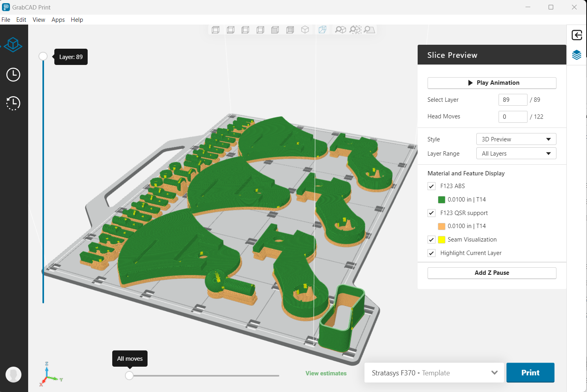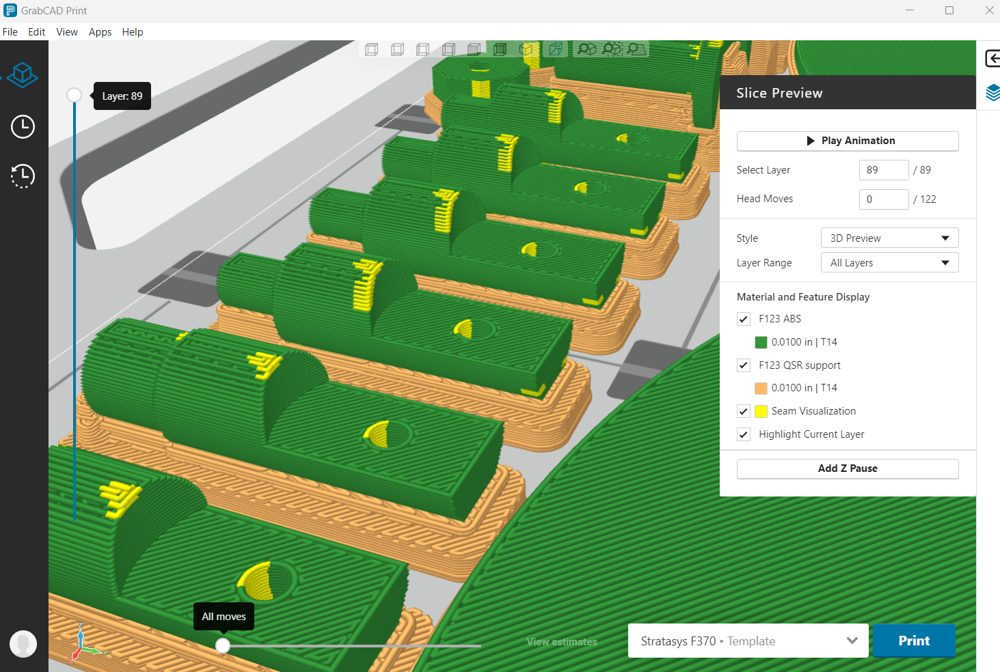
- Upload print file to FDM printer and print using a clean build platform with [ABS filament](https://support.stratasys.com/en/Materials/FDM/ABSplus-P430) and [Soluble Support Material](https://support.stratasys.com/en/Materials/FDM/FDM-Support-Materials). 

    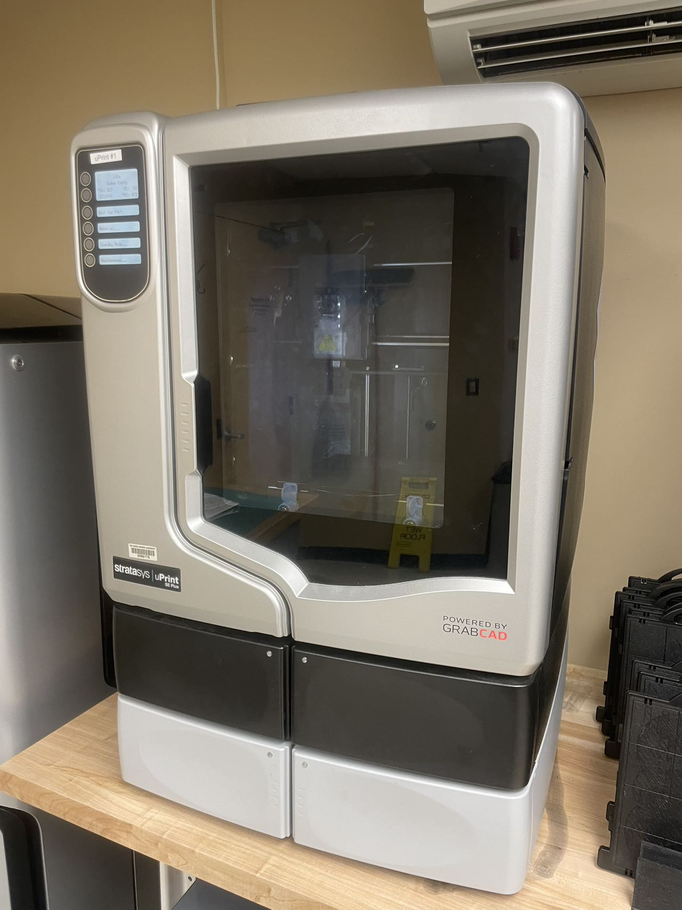
- Once the print has finished, all parts were washed with mild NaOH for 3 hours to ensure all supported material was removed.

    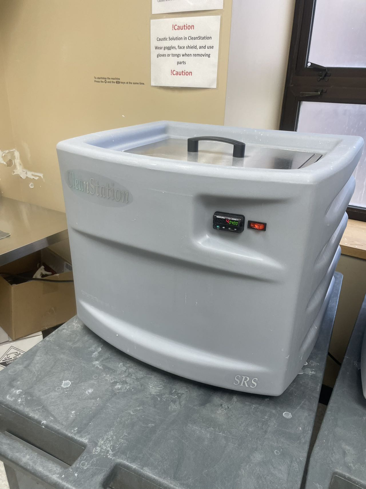